I have recently started working on Kaggle Competition. This was one of the projects to get started. In this document, I will explain all the steps that I took fo this project, along with all the results. The repository contains my code along with all the results and the dataset.

<h2> Titanic: Machine Learning from Disaster </h2> 
In this challenge we are provided with the dataset of passenger of "TITANIC". We have to build a predictive model that can show what type of of people are more likely to survive. 

<h3> Dataset </h3>
we are provided with two datasets -'Train' and 'Test' in a csv file format. Both the files contain same variables . 
The information about each variable is discussed below - its type , descrption (if required), possible value and what is my expectation about its influence in prediction.

  1. Suvival                                                                       
       -> Numerical Feature  
       -> Values :  0 = No survival , 1 = Yes Survival  
  
  2. Pclass : A proxy for Social econmical status  
       -> Numerical Feature  
       -> Values : 1 = Upper , 2 = Middle , 3 = Lower  
       -> High Expectation  
  
  3. Sex  
       -> Categorical Feature  
       -> Values : Male , Female 
       -> High Expectation  
  
  4. Age : Age in year  
       -> Numerical Feature  
       -> Medium Expectation  
   
  5. Sipsp : If the Passenger has Sibling or Spouse on the ship  
       -> Numerical Feature   
       -> Medium Expectation  
   
  6. Parch : if the passenger has parent or child on the ship  
       -> Numerical Feature  
       -> Medium Expectation 
       
  7. Ticket : Ticket Number  
       -> Alphanumeric Feature  
       -> Low Expectation 
       
  8. Fare : Passenger fare   
        -> Numeric Feature  
        -> Low Expectation 
  
  9. Cabin : Cabin Number   
        -> Categorical Feature   
        -> Low Expectation 
  
  10. Embarked : Port of Embarcation   
        -> Categorical Feature  
        -> Values : C = Cherbourg, Q = Queenstown, S = Southampton  
        -> High Expectation
        
The Train data set contains 981 rows whereas the test dataset contains 481 rows.

<h3> Exploratory Data Analysis </h3> 

One of the first steps I did for the EDA was used the 'describe' and 'info' of python to get an overall desciption of the data-set and find out the number if blank null or missing values. 

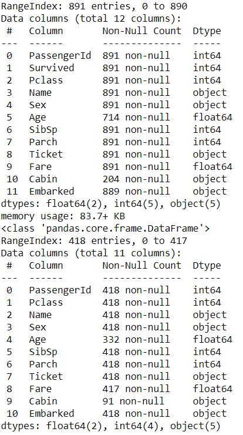

As can be seen from the above image the fields containing the missing values are : 

Checking the data for survival column. 

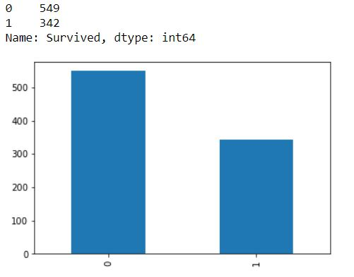

Percentage of people that did not survive is 61.62  
Percentage of people that survived is 38.38  

The data is imbalanced with passenger having low survival Rate. But as the imbalance is not too skewed, I will not be using any data balancing techniques. 
For further analysis, I combined the training and testing dataset. this was done for better analysis and filling of values. 

For the field that according to me had high expectation in prediction. I did a detailed analysis for those field and decided if i shall use them in model building or not.

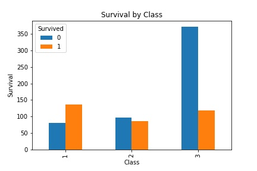

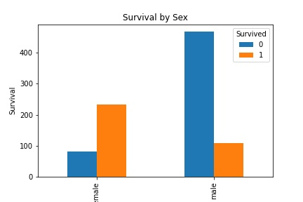

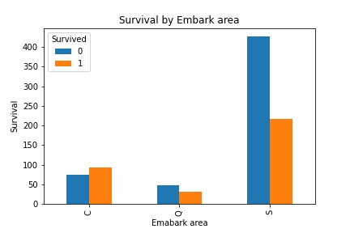

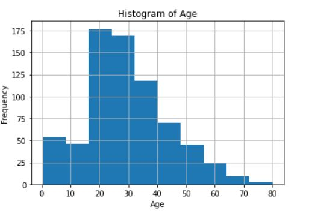

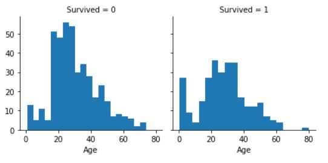

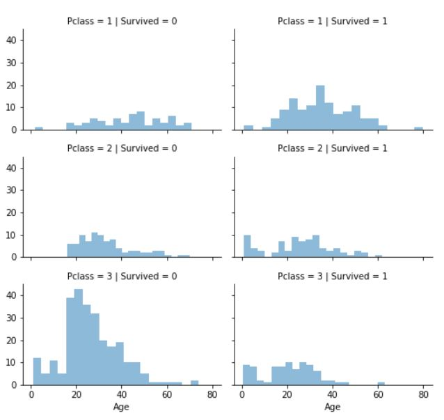

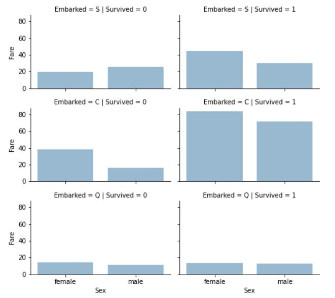

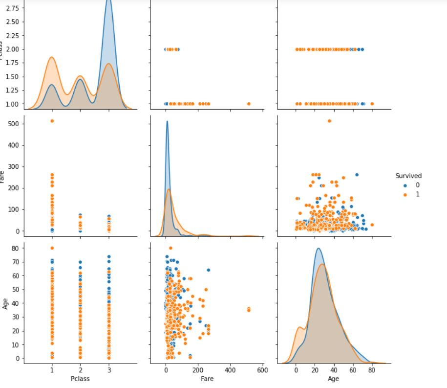

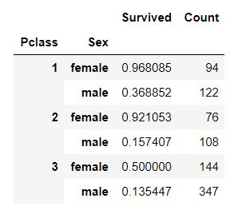

From these graphs and looking into them in detail, I made the following observation 
1. Female Passenger have higher survival Rate. Though exception could be found for Embarked = C where male had higher survival Rate,
2. Pclass = 3 had the most death(least survival rate) whereas Pclass = 1  had the least death ( high survival rate).
3. Most passengers are in 15-35 age range. Large number of 15-25 year olds did not survive.

Thus from these observation, I have decided to keep the following field for model building - Sex, Pclass,Embark and age . Although for age the Value I will band age into groups. 

Now lets use heatmap to see the correlation between different fields.
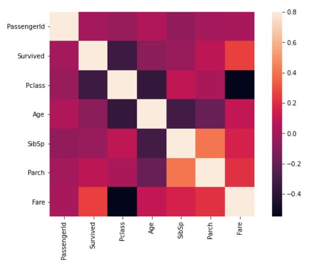

Parch and fare have high correaltion with the survival column.

Now I will combine the two datasets into one dataset so that I can fill the missing values, drop columns that I think are not useful and and create new columns.

Checking the percent of Null values in the data set:   
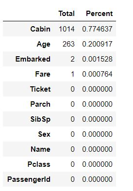

Based on the Null Values I will be dropping 'Cabin' field from the dataset. Also I think ' PassengerId' , 'Ticket', and 'Name' dont make any real impact on the model and thus will be dropping them too ! 

"all_data = all_data.drop(['PassengerId','Ticket', 'Cabin', 'Name'], axis=1)"   </br?

Now to fill the missing values of 'Age'. I will fill the missing values by using other correlated features, which in this case is 'Age', 'Gender', and 'Pclass'. I calculated median age using the combination of these feature. This method has the added advantage of not adding noise to the model. 

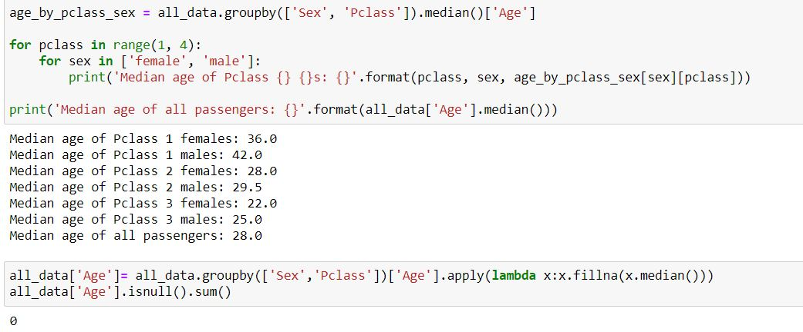

Moving to other fields, age is continous and I will be converting it into 5 bands.

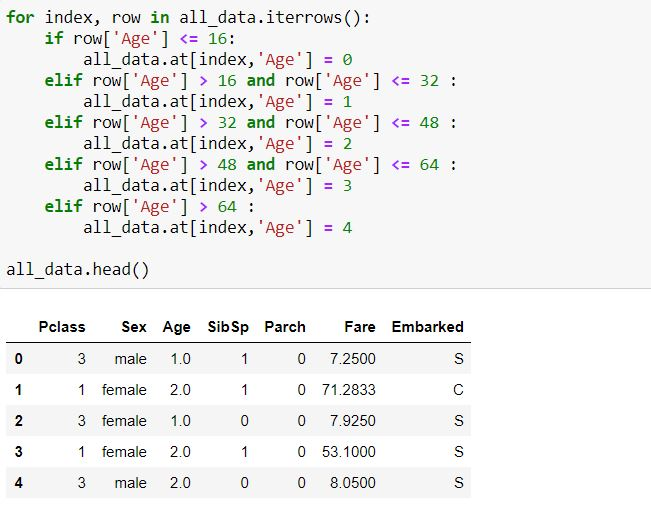

Instead of using 'Parch' and 'Sibsp' fields as it is, I will be adding a logical field 'Family' that will be true if any of the field has any value other than '0'. After which I will drop these two fields. 

"all_data['Family'] = (all_data['SibSp'] > 0) | (all_data['Parch'] > 0)"  

"all_data = all_data.drop(['SibSp','Parch'], axis=1)"  

for the Filling of Embarked missing values , I had two option : just drop the rows or fill it with most frequent port. I went ahead with filling of most important field. In this case the most frequent value is : "S" . 

The fare field was also converted into bands: 

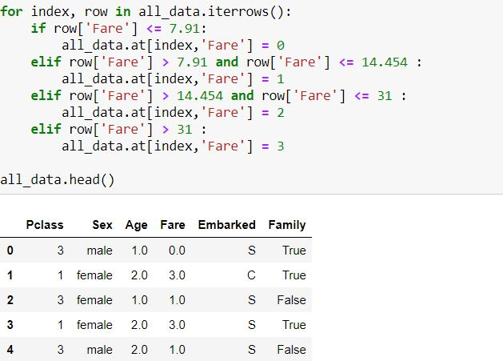

I will use the label encoder function provided by scikit learn for pre-processing but mapping function is also an option

lbl= LabelEncoder()  
lbl.fit(list(all_data['Sex'].values))  
all_data['Sex'] = lbl.transform(list(all_data['Sex'].values))  

lbl.fit(list(all_data['Embarked'].values))  
all_data['Embarked'] = lbl.transform(list(all_data['Embarked'].values))  

Now the data is ready for model Building!  

<h3> Model Building and Prediction </h3>

As this is a classification and regression problem and requires supervised learning, for Model I have decided to try these three models:  

1. Random Forest Classifier  
2. Gradient Boosting Classfier  
3. Logistic Regression  

Their code and training is given in the Jupyter Notebook - "Titanic_ml" .  

I got the highest accuracy of 77% from these models.  

One of the way that I plan to further increase the accuracy is by adding Cross Validation and Ensemble Models.
        
        
        
        
        
      
      
